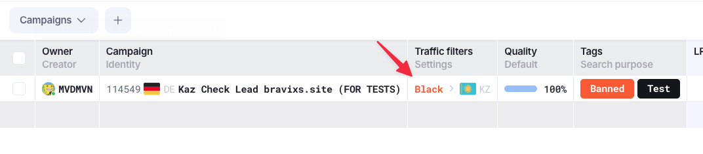
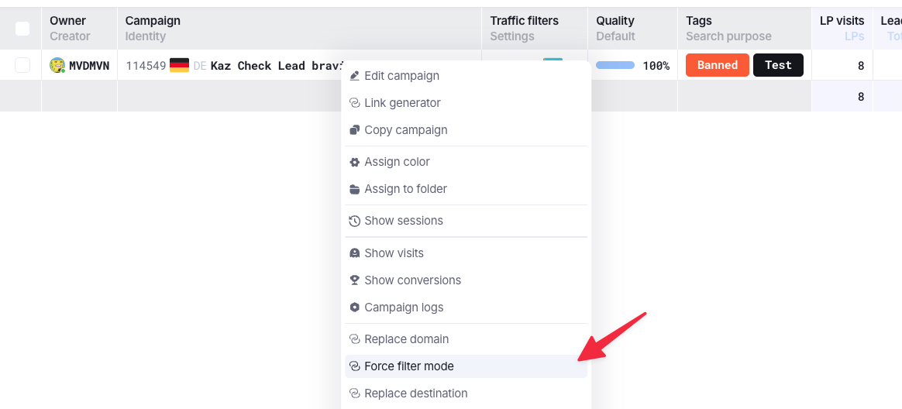
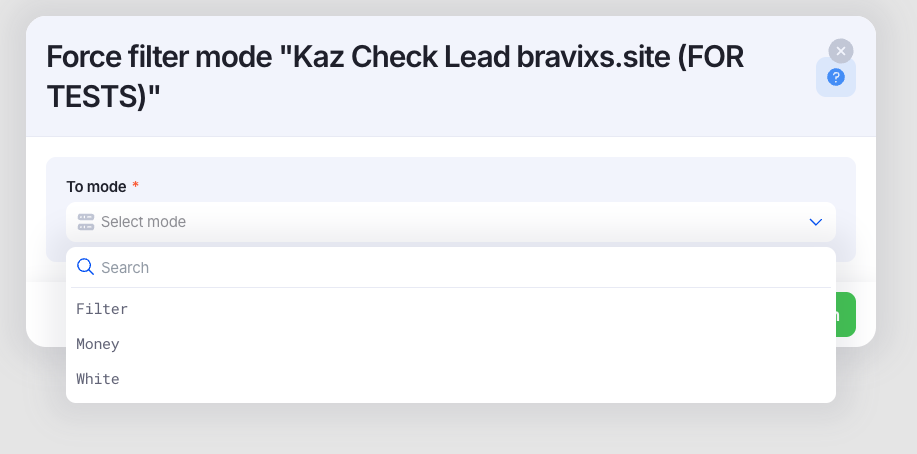

# How to check or change cloack

!!! info "Клоака"
    По умолчанию, когда создаётся сетап, то клоака выставлена на то, чтобы были активны и `Black` и `White`

### Проверка того, как сейчас настроена клоака

Для проверки необходимо зайти в список кампаний `Tracker` -> `Campaigns`

У каждой кампании есть одна из ячеек, которая отвечает за индикацию состояния клоаки

### Смена типа клоаки

Для того, чтобы переключить клоаку, необходимо на нужной кампании нажать `ПКМ` и выбрать пункт `Force filter mode`

В открывшейся модалке необходимо выбрать нужный тип клоаки. Всего их 3 штуки:

1. `Filter` - это стандартный вид клоаки. `Black` - для целевой аудитории, `White` - для нецелевой аудитории.
2. `Money` - клоака работает только на `Black`, весь траф идёт только на него.
2. `White` - клоака работает только на `White`, весь траф идёт только на него.

После сохранения изменения применятся сразу, больше ничего менять не нужно.