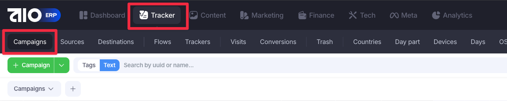
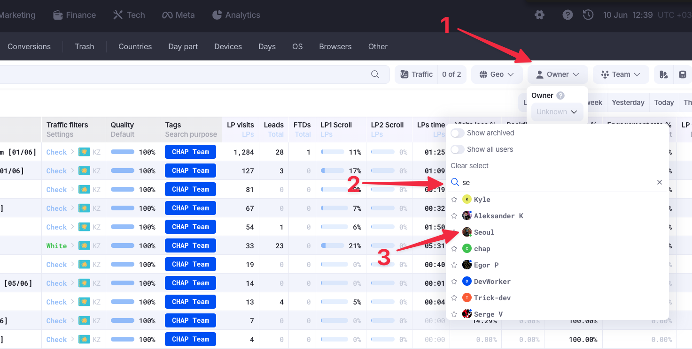
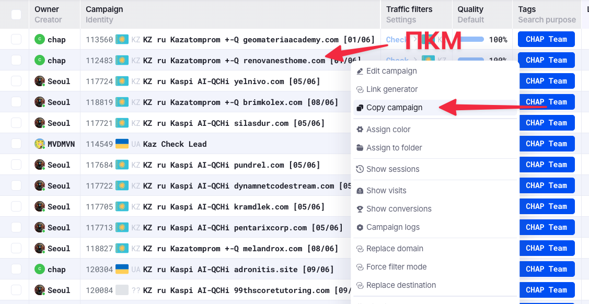
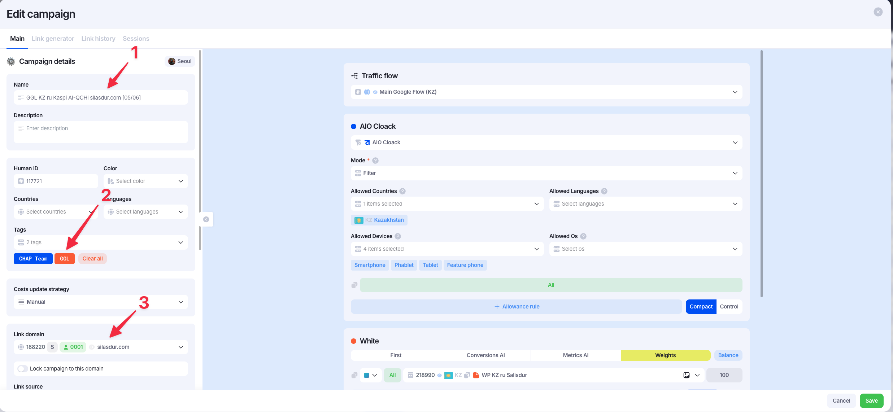
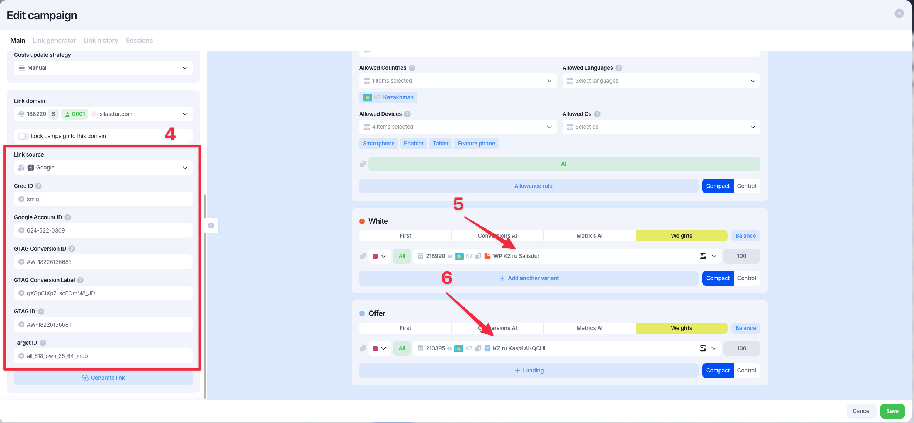
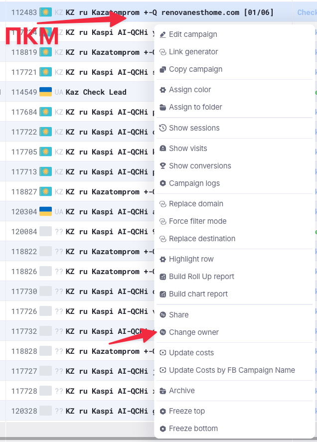
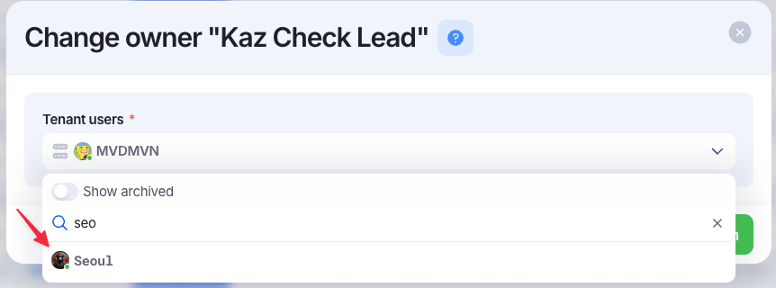

# Creating new campaign

!!! info "Домены и сервера для сетапов"
    Процесс закупки доменов и серверов, проксирования и прокидывания доменов на сервера, будет отображён в других статьях. Тут сугубо процесс создания кампаний

С самого начала переходим в [таблицу](https://docs.google.com/spreadsheets/d/1sFWRIoMIeGW5lL3DhCO4o2dgEWFmaVTMPpPZ7h72YE4/edit?gid=40724409#gid=40724409) с доменами для AIO и резервируем уже закупленные или идём закупать новые и заносим в таблицу, если это `facebook` сетапы. Если это `google` сетапы, то необходимо купить их, проксировать и закинуть на сервер.

После этого переходим во вкладку `Tracker`, затем в подпапку `Campaigns`.

Далее, необходимо найти баера, которому будут делаться кампании, и выставить по нему фильтр.

1. В фильтрах находим кнопку `Owner`
2. После нажатия появится всплывающее окошко со списком баеров. Там есть инпут с поиском. Вводим туда ник баера
3. Нажимаем на нужного баера, и фильтр по баеру применится

Когда все кампании баера отобразятся, можно брать любую подходящую кампанию и копировать её. На скрине представлен пошаговый процесс того, как копировать кампанию для `Google` сетапа.

1. Находим нужную кампанию у баера
2. Нажимаем на неё ПКМ
3. Выбираем пункт `Copy campaign`

После нажатия на кнопку копирования, откроется модальное окно с данными для новой кампании. Тут мы можем начать редактировать данные новой кампании.

!!! warning "Важно!"
    Когда открывается модалка со "скопированной" кампанией, она ещё не создана, и если ввести все данные в поля, не сохранить и закрыть модальное окно, то кампания вообще не создастся.

Какие поля нужно менять, наглядные примеры на двух скринах ниже списка:
1. Меняем поле с названием кампании. Меняем оффер (если отличается), домен и дату сетапа
2. Меняем сам домен кампании, то есть, с каким доменом будет генерироваться ссылка сетапа
3. Чистим все поля в выделенном блоке. Все эти значения баер сам подставляет перед запуском
4. Меняем вайт на тот, который указан в задаче
5. Меняем или оставляем оффер

Когда все пункты пройдены, просто сохраняем кампанию

Когда кампания создана, очень важно поменять её `Owner` на баера, который заказал сетап.

!!! warning "Важно!"
    Если этого не сделать, то баер не будет видеть кампании.

Чтобы поменять `Owner` кампании, необходимо нажать на неё ПКМ и выбрать пункт `Change owner`. В открывшемся модальном окне нужно выбрать нового владельца кампании - баера.

Когда все эти шаги закончены, повторите всё вышеперечисленное нужное количество раз, пока не будут готовы все сетапы.
