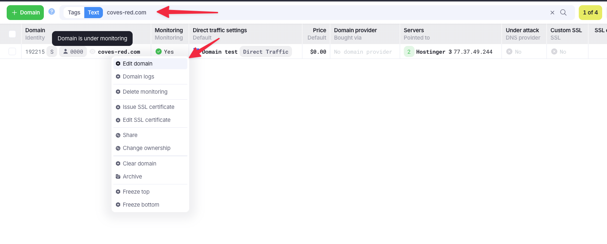
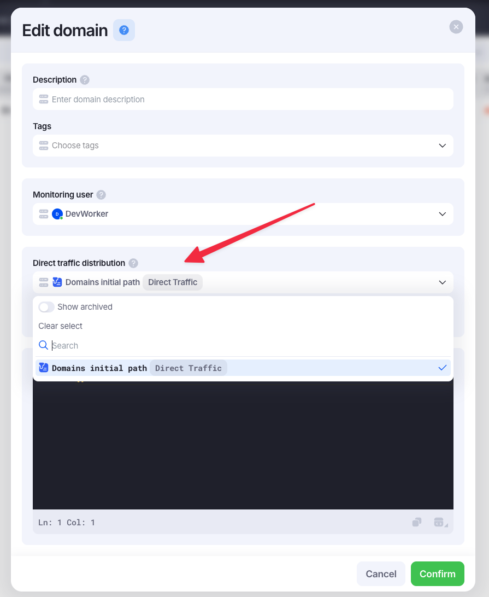
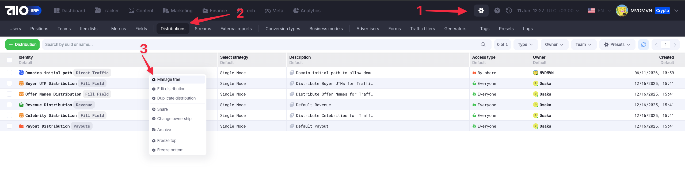
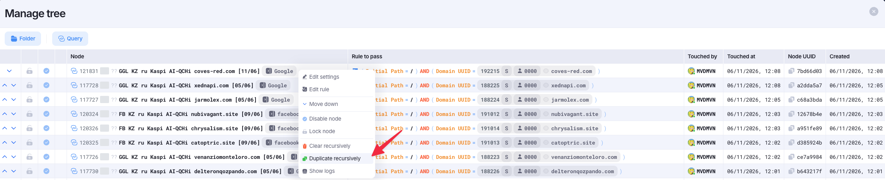
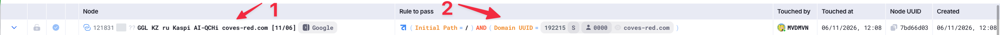
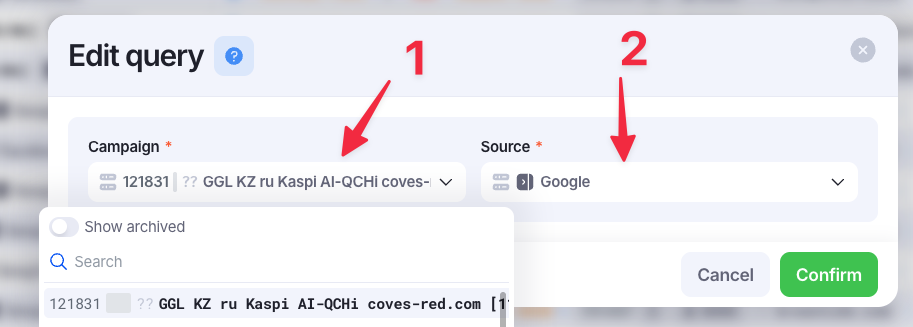
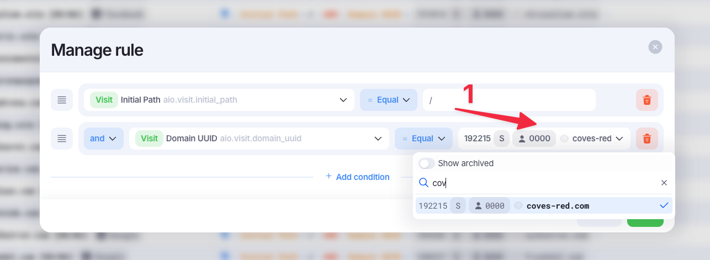

# Domains initial path

!!! info "Что это такое"
    Включение initial path - это добавление возможности перехода по домену без хвоста с UTM-метками, однако они будут применяться под капотом.

### Настройка домена на редирект без хвоста

После покупки домена и добавление его в AIO, необходимо включить ему возможность перехода по нему без хвоста кампании. Первый шаг нужно делать по-умолчанию для всех доменов.

Переходим во вкладку `Tech`, затем во вкладку `Domains`. Находим нужный домен и нажав ПКМ, выбираем `Edit domain`.

В открывшемся окне необходимо открыть поле `Direct traffic distribution` и выбрать пункт `Domains initial path`.

Сохраняем изменения. Подготовка домена готова.

### Настройка кампании на редирект без хвоста

Когда подойдёт время домена и его нужно будет сетапить в конкретную кампанию и этот процесс был завершён, кампанию необходимо настроить на работу без хвоста.

Для этого необходимо:

1. Перейти на страницу настроек
2. Перейди во вкладку `Distribution`
3. На элементе с именем `Domains initial path` нажать ПКМ и выбрать пункт `Manage tree`

В открывшемся окне виден список всех `Query`, которые есть в выбранном `Distribution`. Нам необходимо скопировать тот, который подходит сугубо по источнику - `Google` или `Facebook`.

У скопированного `Query` необходимо провести изменения в двух областях. При нажатии на каждую из них, будет открываться окно, где нужно вносить изменения. Вносить изменения нужно просто нажав на нужное поле ЛКМ, после чего откроется модальное окно с настройкой.

1. Это поле названия самой кампании и её источника. Нужно выбрать саму кампанию по домену, а так же источник, под который делалась кампания.

2. Это поле правила `Query`. Тут мы указываем, что у этой кампании будет `Initial path` в виде `/`, а потом конкретизируем то, для какого домена это применяется.

!!! warning "Важно!"
    Это нужно делать для КАЖДОГО ДОМЕНА и КАЖДОЙ КАМПАНИИ. Так же, время от времени необходимо чистить этот список `Query` в случае, когда кампании почистили и больше не используются.