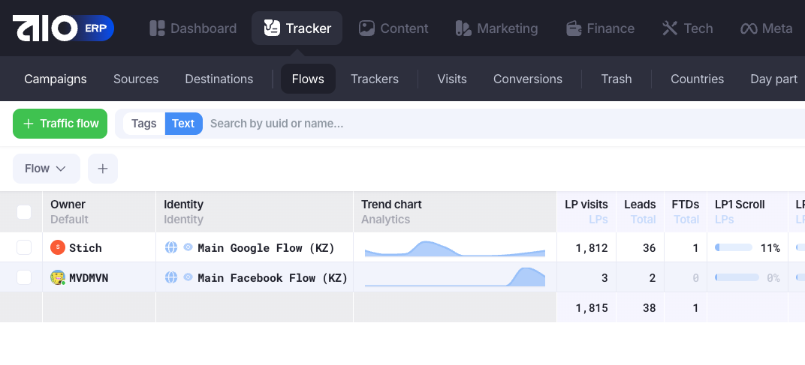
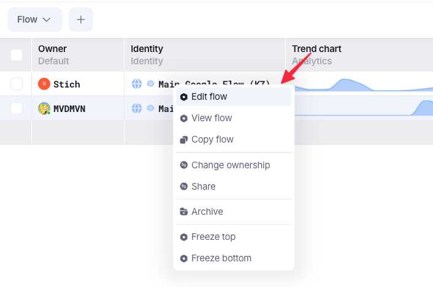
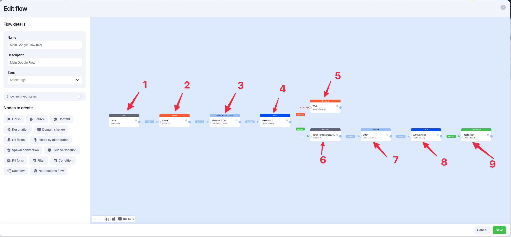

# Flow explanation

!!! info "Зачем нужен Flow"
    Flow - это алгоритм того, как работает кампания в момент, когда пользователь перешёл по ссылке. Пошагово выполнение блока за блоком с проверками и условиями.

С самого начала переходим в [таблицу](https://docs.google.com/spreadsheets/d/1sFWRIoMIeGW5lL3DhCO4o2dgEWFmaVTMPpPZ7h72YE4/edit?gid=40724409#gid=40724409) с доменами для AIO и резервируем уже закупленные или идём закупать новые и заносим в таблицу, если это `facebook` сетапы. Если это `google` сетапы, то необходимо купить их, проксировать и закинуть на сервер.

Чтобы перейти к списку `Flow`, необходимо в меню нажать на `Tracker`, затем перейти во `Flows`.

На открывшейся странице будут видны все `Flow`, которые доступны на данный момент. `Flow` отличается по типу источника, куда всё льётся - `Google` или `Facebook`.

Для просмотра нужного `Flow`, необходимо на нужном нажать ПКМ и выбрать `Edit flow`

После открытия нужного `Flow`, мы видим модальное окно с данными о нём. Слева в панели указано название `Flow`, его описание и тэги.

Справа - поток выполнения `Flow`. Ниже будет пошаговый список и скрин описания того, как работает на примере `Main Google Flow (KZ)`

1. Это старт выполнения потока, он добавляется автоматически
2. Выставляет источник, который был указан в кампании
3. Система берёт метку баера (owner кампании) и сохраняет её
4. Далее идёт проверка клоаки
5. Если клоака не прошла, то переходим на вайт
6. Клоака прошла - мы инициализируем форму, которая является частью AIO и её подхват полей
7. Отображение самого оффера пользователю
8. Финальная проверка, что пользователь реален и это не бот
9. Сайт или страница, куда перенаправляется посетитель в результате успешной отправки лида. (Мы это не используем, так как у нас переход на страницу спасибо реализован в макросе)

По сути, `Flow` один раз настраивается и не должен трогаться, мы только выставляем его в кампании.

!!! warning "Важно!"
    При смене `Flow`, во всех кампаниях, которые используют этот `Flow`, сбросятся настройки вайта и оффера, а если изменить настройки клоаки, то слетят и они.