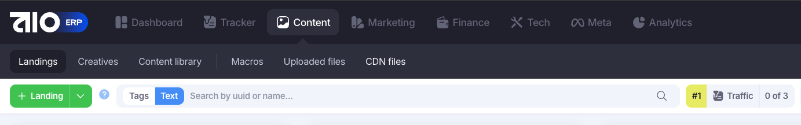
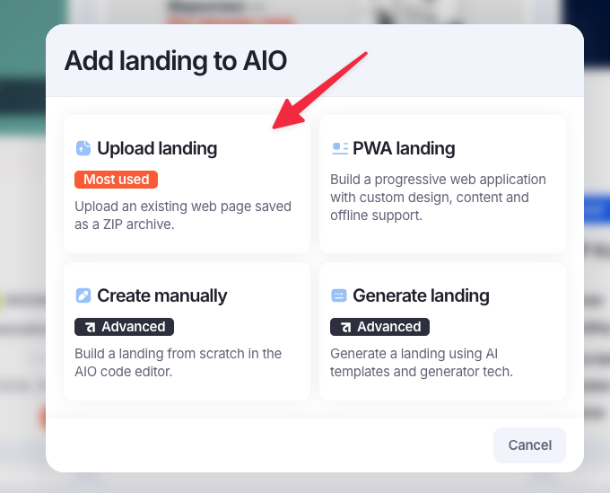
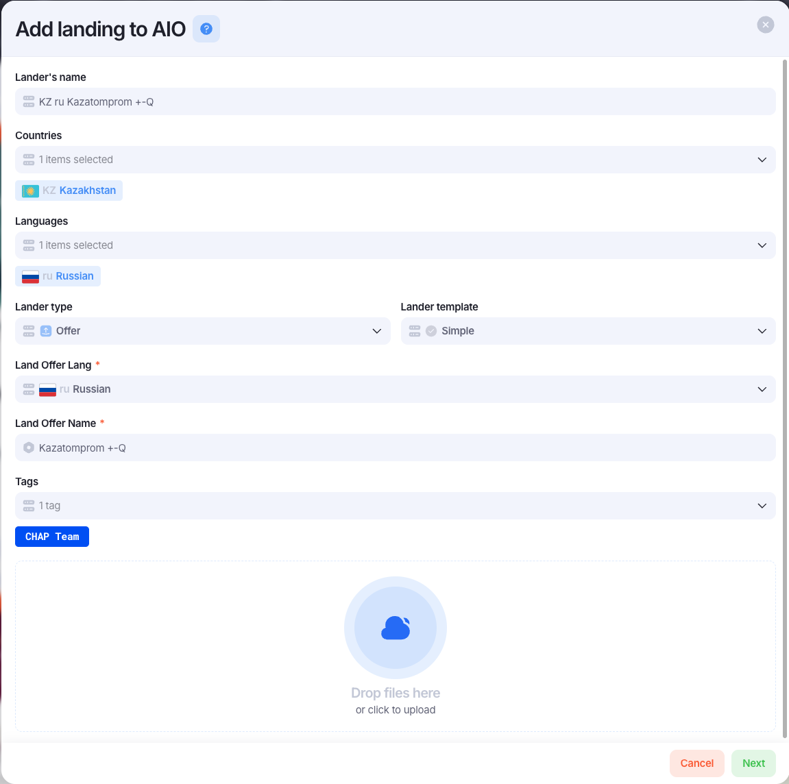

# Adding new offer

!!! info "Заголовок"
    В статьях может проскакивать `лендинг`, `ленд` и т.д., так как в AIO всё хранится во вкладке `Landings`, поэтому нужно исходить из контекста того, что обсуждаем, вайт оффер или преленд.

Для добавления нового оффера в AIO, необходимо перейти во вкладку `Content` => `Landings` => Нажать на `+ Landing`

Должно появиться модальное окно. Нужно выбрать `Upload landing`

Далее, откроется модалка с данными про оффер. Все поля нужно заполнить по аналогии с тем, как они заполнены на скрине

Список полей и их обозначения:

1. Lander's name - имя самого ленда оффер
2. Countries - страна, для которой был сделан оффер
3. Languages - тот язык, для которого предназначен оффер, пока этим не пользуемся, но возможно, будем в будущем
4. Lander type - это тип загружаемого ленда. Для офферов выбираем `Offer`
5. Lander template - всегда выбираем Simple
6. Land Offer Lang - это аналог offerLang из script.js, который теперь заполняется для того, чтобы передавать в CRM язык оффера
7. Land Offer Name - это аналог offerName из script.js, который передаёт название оффера в CRM
8. Tags - тэг команды, для которой заводим оффер
9. Поле для архива с оффером.

Как подготовить оффер к загрузке в AIO читай в [инcтрукции по адаптации оффера](offer-adapt.md)