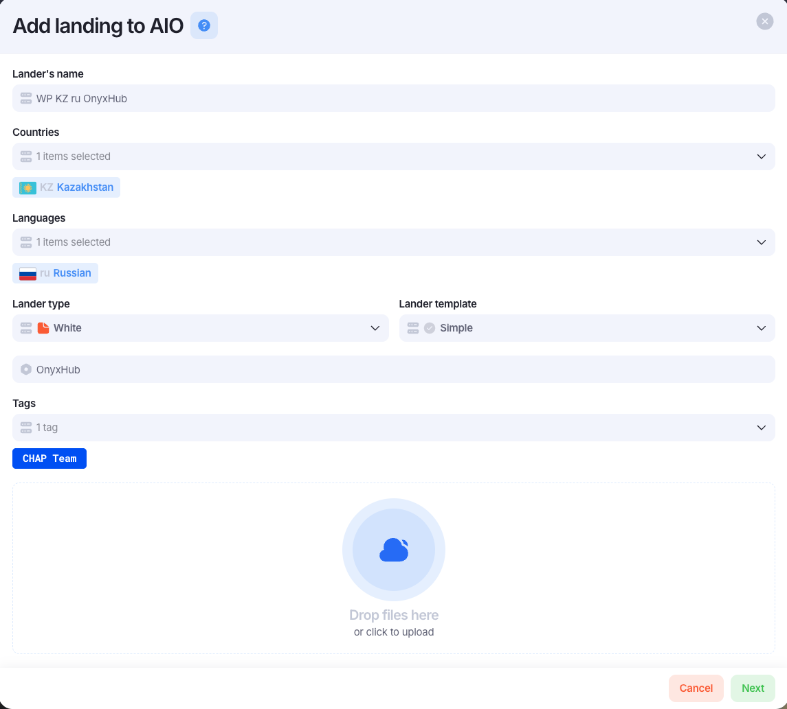
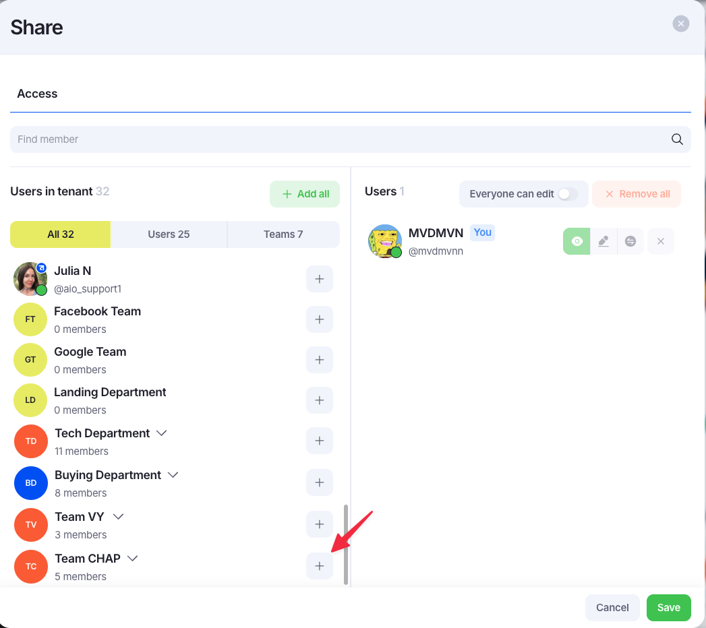

# Adding new white

Для добавления нового вайта в AIO, необходимо перейти во вкладку `Content` => `Landings` => Нажать на `+ Landing`

Должно появиться модальное окно. Нужно выбрать `Upload landing`

Далее, откроется модалка с данными про вайт. Все поля нужно заполнить по аналогии с тем, как они заполнены на скрине

### Объяснение полей модалки

1. `Lander's name` - название вайта. Название строится из таких ключевых слов:
    1. `WP` - указание, что это вайт
    2. `KZ` - это гео для которого будет использоваться вайт
    3. `ru` - язык на котором сделан вайт
    4. `Название вайта` - само название вайта, как назван архив или название сайта в самом коде.
2. `Countries` - страна, для которой будет использоваться вайт
3. `Languages` - язык вайта, может применяться фильтр по языку
4. `Lander type` - тип лендинга. В нашем случае - вайт
5. `Lander template` - всегда ставится `Simple`. Это то, какие доп. поля использовать
6. `Инпут с шестигранником` - это как раз доп. поле благодаря `Lander template`, оно не нужно для вайта, но лучше заполнить просто названием.
7. `Tags` - тэг команды, для которой заводим вайт

### Share вайта

После того, как мы добавляем вайт, нужно сделать `Share` этого вайта той команде, для которой заводился вайт.

В открывшейся модалке необходимо найти нужную команду и нажать возле неё `+`, тогда вайт будет разшарен на всех членом команды

После чего нажать `Save`. Добавлени вайта готово
