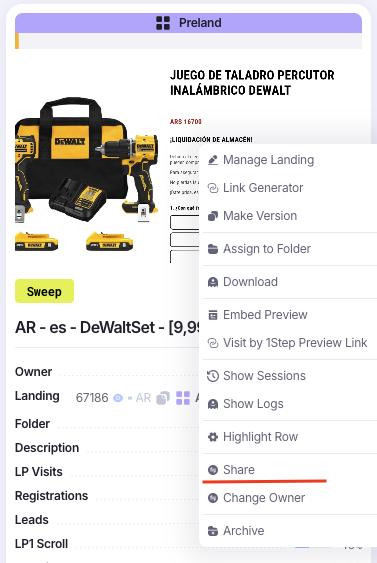

# Access

Все доступы добавляются по одному принципу:

Правой кнопкой мыши нажимаем нужный объект(компания, лендинг или оффер), выбираем “Share” и добавляем нужных пользователей. Доступы разработчикам не нужны, они у них, по умолчанию

## Кампания:

Доступ на просмотр даем тимлиду баера, который заказал кампанию. Так же через “Change owner” меняем владельца кампании с себя, на баера, который заказал ее

## Лендинг и Оффер:

Доступ на просмотр даем всем командам баеров

