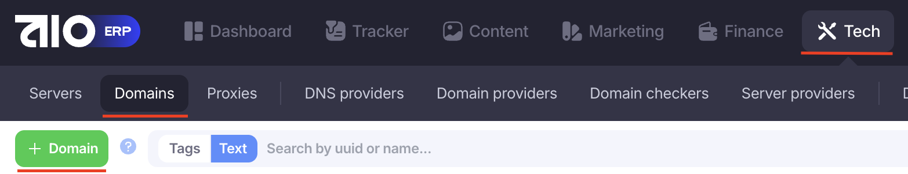
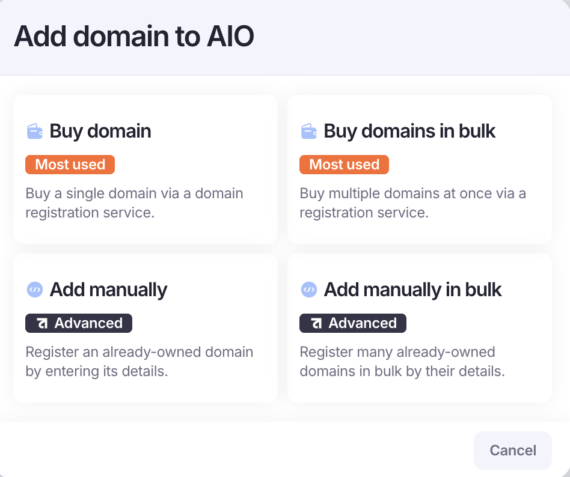
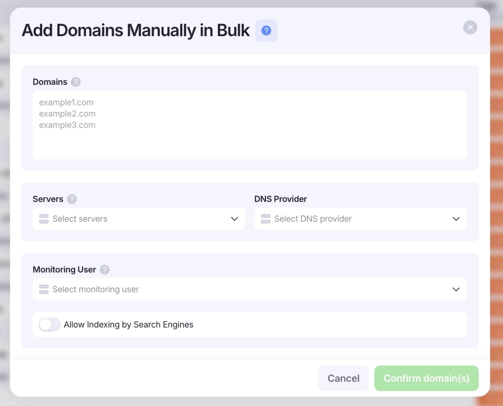

# ADDING DOMAINS

Таблица доступов

| Team  | Spaceship    |                   | Cloudflare                                                                  |                  |
| ----- | ------------ | ----------------- | --------------------------------------------------------------------------- | ---------------- |
|       | Login        | Password          | Login                                                                       | Password         |
| Kobe  | DirielDixon  | jLM@9Ssi2r\*b9!uu | [k0beblock.rifling684@slmails.com](mailto:k0beblock.rifling684@slmails.com) | l%Z82YdAM09p&&bM |
| Trick | TrickyMaldro | AvzepSIJ3R\*QlX9B | [trickbox.spoof041@dralias.com](mailto:trickbox.spoof041@dralias.com)       | Tr!ck#8QZ_59A    |
| Hui   | TrickyMaldro | AvzepSIJ3R\*QlX9B | [trickbox.spoof041@dralias.com](mailto:trickbox.spoof041@dralias.com)       | Tr!ck#8QZ_59A    |

1. Домены закупаем на Spaceship как обычно. У каждой команды свой аккаунт и карта, в Payments Info можно увидеть актуальный баланс, при необходимости - пополнить.
2. Далее [**проксируем**](domain-proxying.md) домены.
3. После того как наши домены прокинулись, нужно их добавить в AIO:

- Заходим во вкладку Tech → Domains и нажимаем на кнопку +Domains

- Выбираем Add Manually(если нужно добавить 1 домен) или Add Manually Bulk(если много)

- Нам для обычной закупки надо выбрать Add Manually Bulk и заполнить поля:
  Domains - добавляем списком как при проксировании(максимум 25 - ограничение от AIO)
  Servers - выбираем сервер с тем IP который мы указывали при проксировании
  DNS Provider - не указываем, так как мы уже прокинули их
  Monitoring User - указываем себя.
  Индексацию не трогаем.

Делимся доступами на просмотр и редактирование к доменам с командой которая их запрашивала, и добавляем теги команды к каждому домену.
