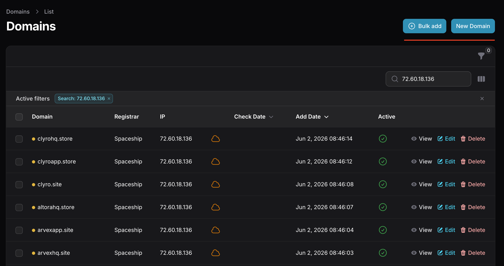
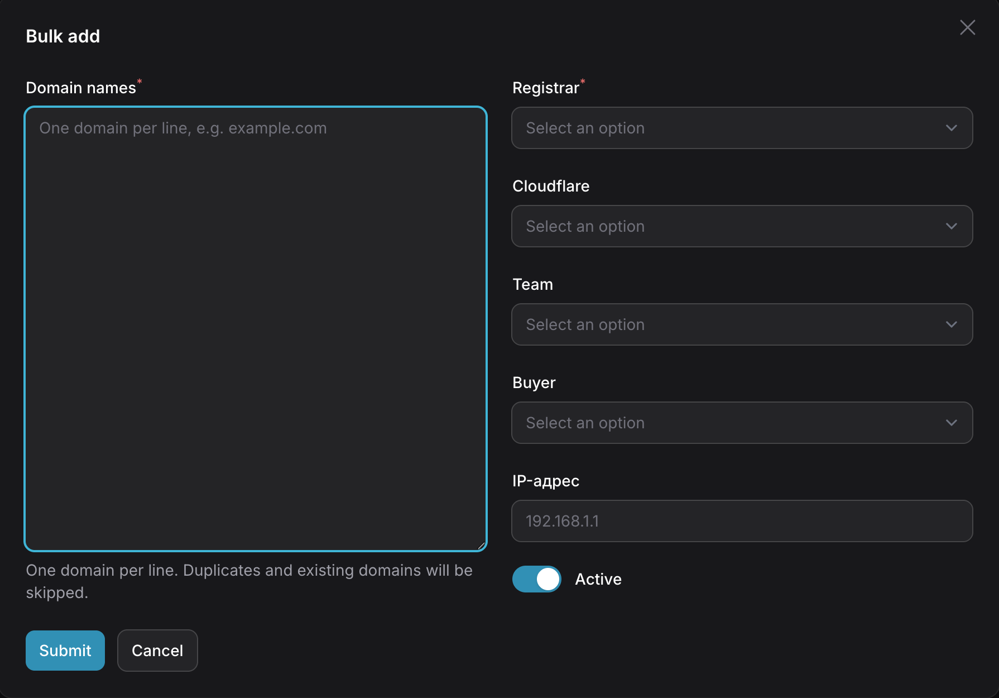
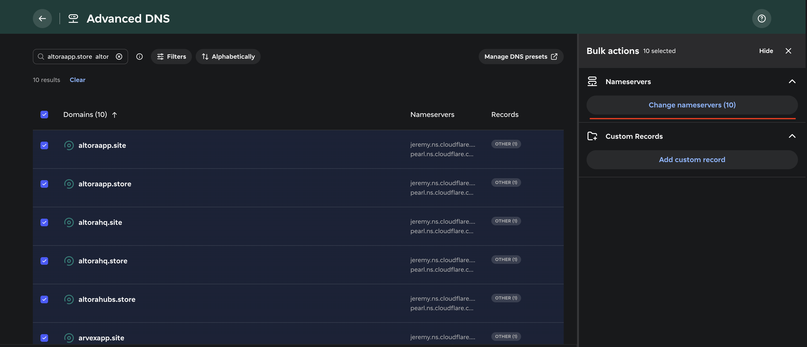
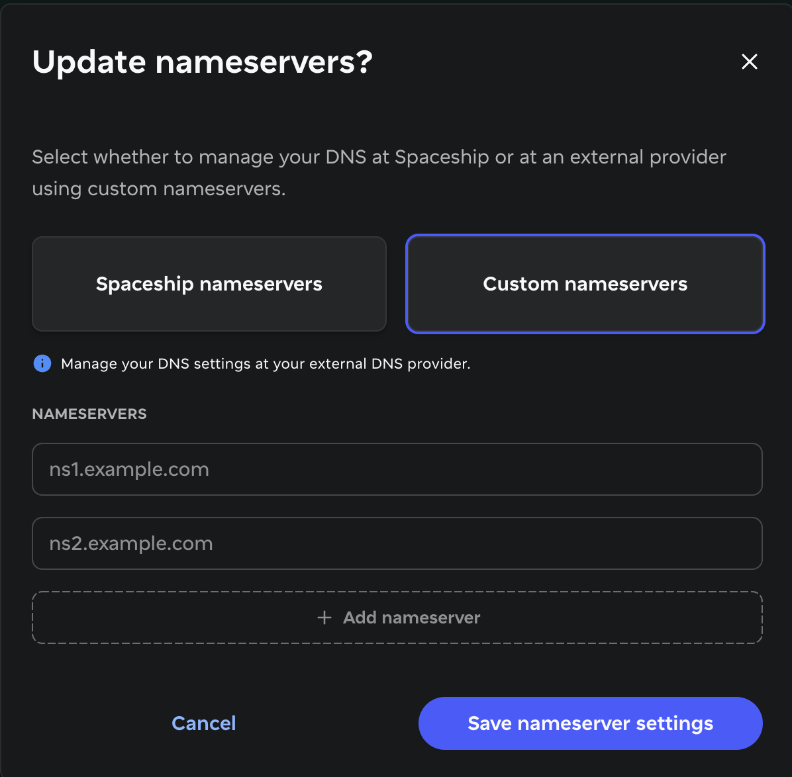
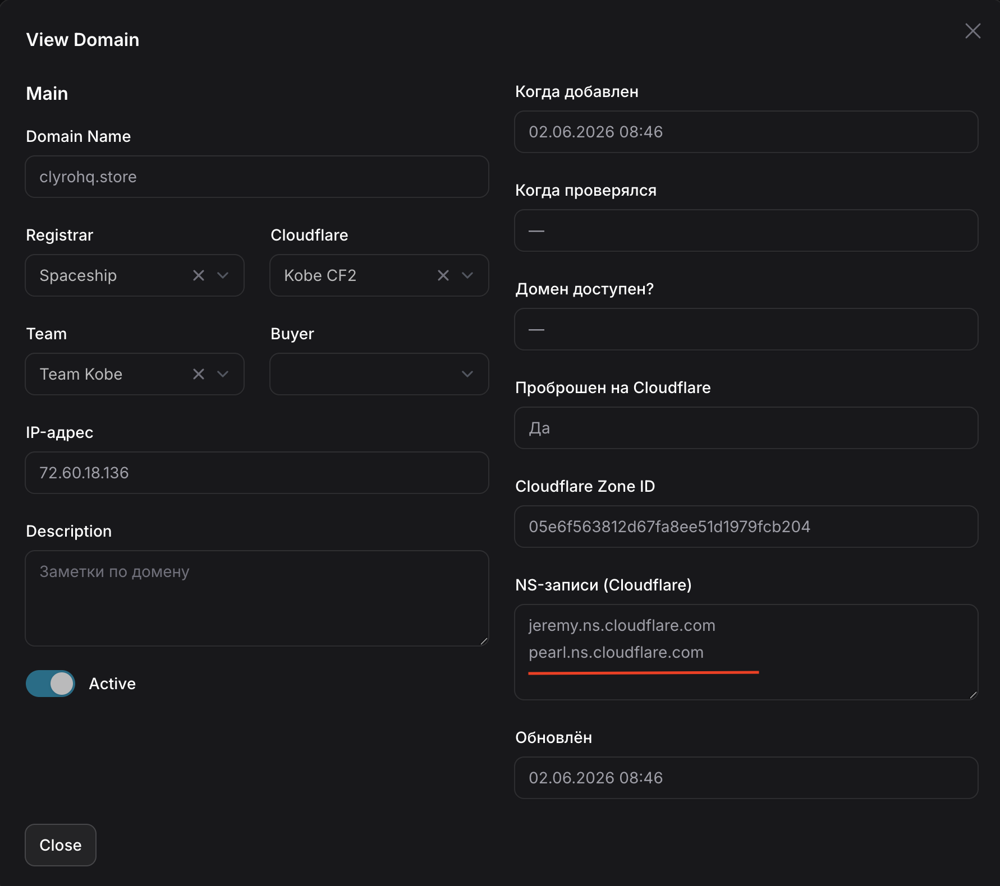

# Domain Proxying

1. Проксируем через CloudeFlare, используя внутренний сервсис [https://getea.work/dashboard](https://getea.work/dashboard/domains)
2. New Domain используем для добавления одного домена, а Bulk add для добавления группы, обычно используем его

## Заполняем поля:

1. Domain names(не больше 20 доменов за раз, иначе будет 504 ошибка и добавятся не все). Вносим сюда домены списком без лишних символов
   Пример:
   domain1.site
   domain2.site
   domain3.shop

- Registrar - Spaceship
- Cloudflare - выбираем клауд команды, которой закупаем домены
- Team - выбираем команду, которой закупаем домены
- Buyer - пропускаем, если закупаем на команду. Если закупаем под конкретного баера, то выбираем нужного
- IP-адрес - берём IP сервера команды из АИО. Не стоит несколько групп доменов подряд закидывать на один сервер, в случае бана они все вылетят, лучше чередовать. К примеру пачку на KOBE4, другую пачку на KOBE3 и т.д.

Добавляем им Nameservers. Возвращаемся в Spaceship → Advanced DNS
Выбираем все наши новые домены и через Change nameservers меняем им NS

NS записи мы можем взять из информации о домене, который на таком же IP сервера в LeadAR CRM

Дальше ждем 20-40 минут пока прокинуться все домены. За статусом доменов можно следить в Cloudeflare(статус наших доменов должен сменится с invalid nameservers на Active) или в Spaceship(статус наших доменов должен сменится с in propagation на online)
