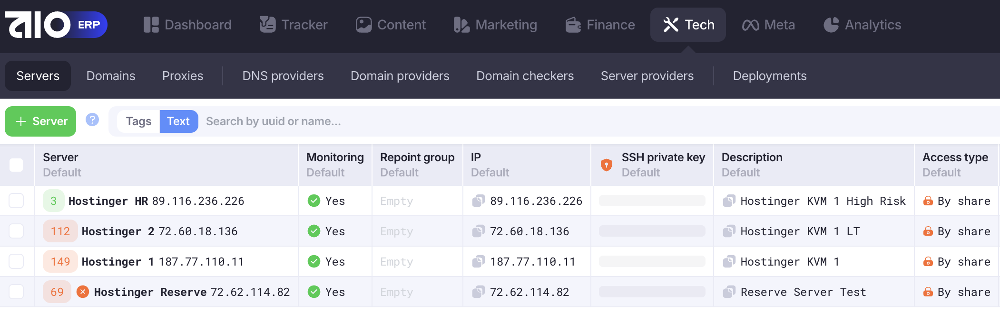
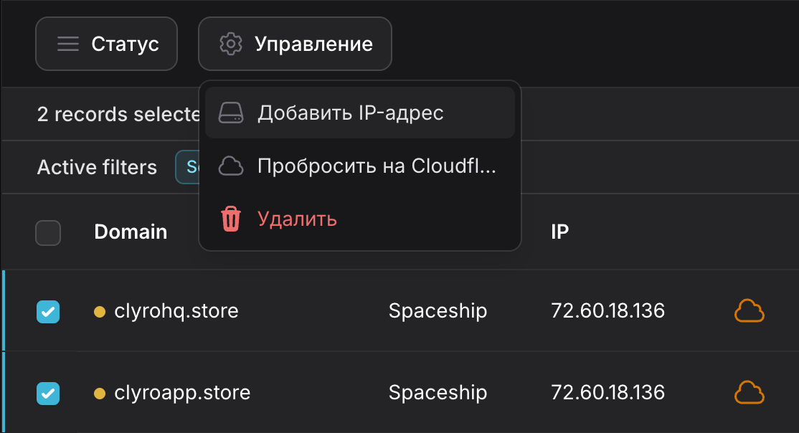
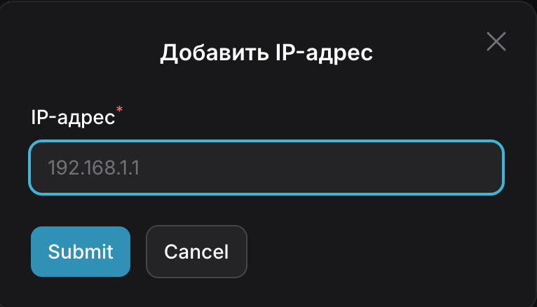
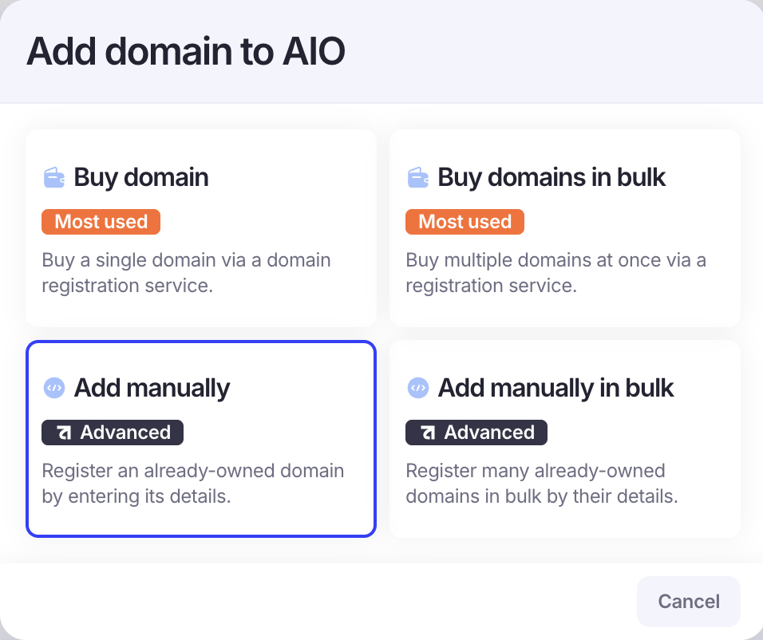
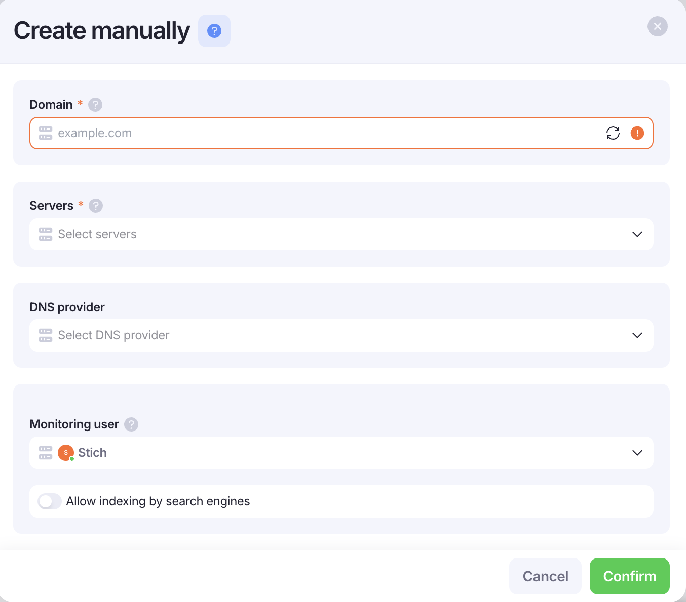

# Domain Recovery

# Статус на регистраторе

Первым делом нужно проверить статус домена на регистраторе:

SUSPENDED - это бан 100%, домен не восстанавливаем

Если на регистраторе домен верный проверяем его дальше:

- Стоят ли правильные NS ?
- Есть ли домен в Cloudeflare и какой IP указан в DNS Records

Исправляем эти пункты и проверяем в AIO статус домена

# Если забанен сервер

Это можно увидеть в вкладке AIO → Tech → Servers. Отлетевший сервис - будет с красным крестиком

Чтобы быстро вернуть домены в работу нужно:

- Получить список доменов на восстановление(запросить у Тимлида, чьи домены отлетели)
- Удаляем домены из списка в AIO. Выделяем интересующие домены чекбоксами, через правую кнопку выбираем Clear Domain
- Переназначаем IP доменам в LeadAR CRM. Отмечаем нужные домены → Управление → Добавить IP-адрес.Вписываем IP сервера на который домены переезжают

- Добавляем через Add manually домены. Выбираем сервер, на который перенесли домены. Провайдера пропускаем, индексацию не трогаем

- Снова даём доступы на просмотр и редактирование доменов нужной команде
- Добавляем к доменам тег команды
