# Fix_Template: передача media-параметров

# US - us - Boneless Sofa quiz v1

1. Выбираем пункт “manage landing”

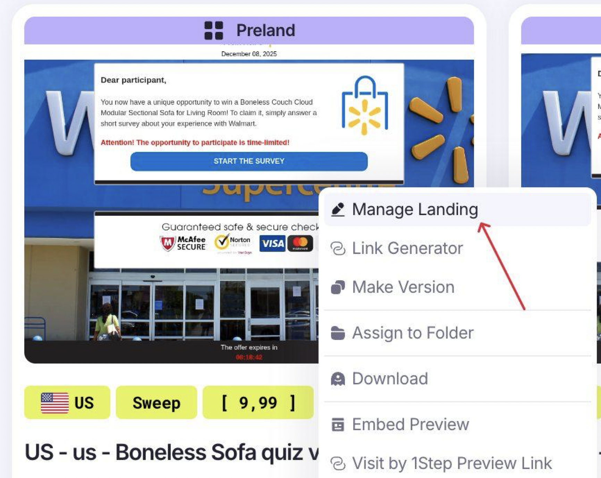

1. Режим “**Split**” для одновременного просмотра кода и визуальной части 

В дальнейшем можно продолжать работу в режиме **Visual**, но сейчас рассмотрим этот вариант, чтоб увидеть как отображается на коде замена элемента

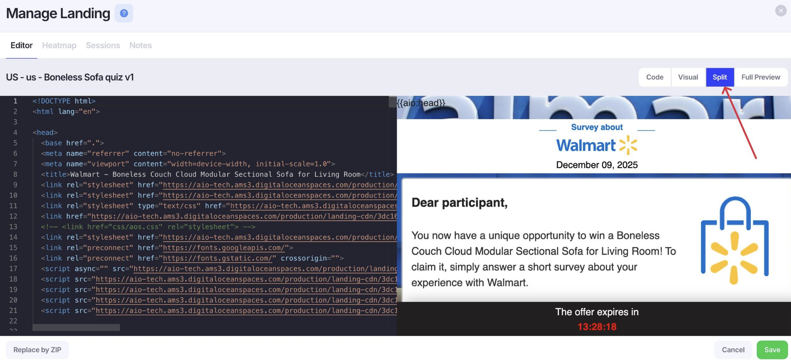

1. На визуальной части выбираем элемент, который нужно заменить и прожимаем его  - автоматически в коде подсвечивается путь к выбранному элементу

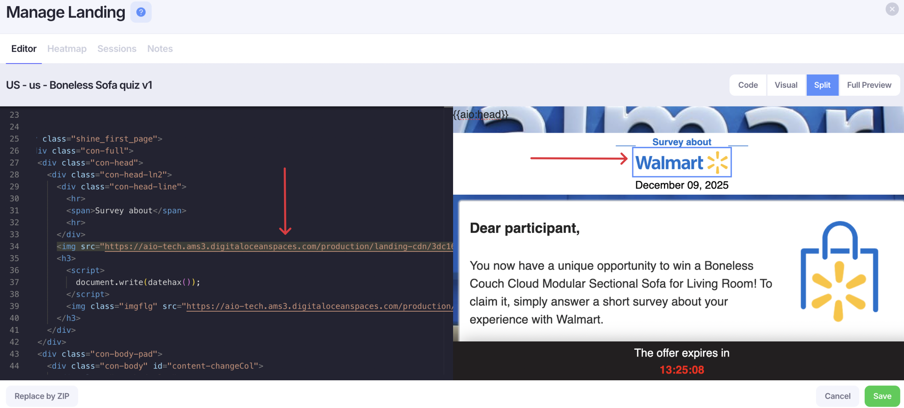

1. Прожимаем элемент еще раз и выбираем “Edit image”

1. Выбираем подгрузку с ПК 

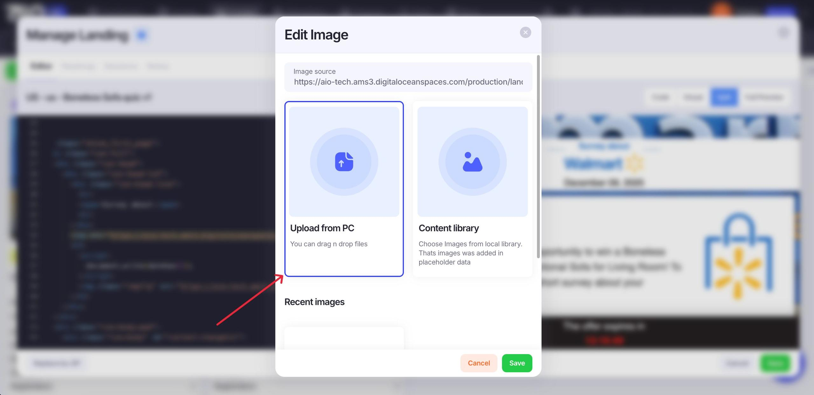

1. Выбираем нужный media-элемент и подгружаем его

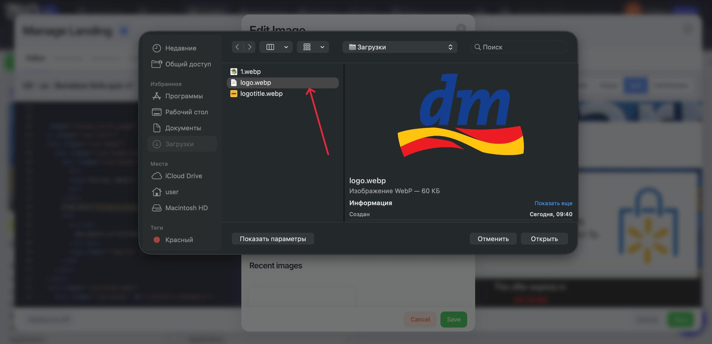

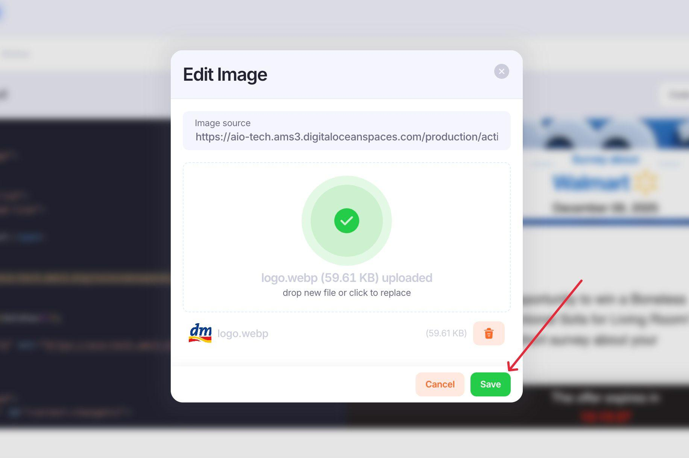

1. Готово, новый элемент отображается, “хвост” в пути к картинке изменился (обращаем на это внимание для самопроверки) - фото подгружено успешно ✅

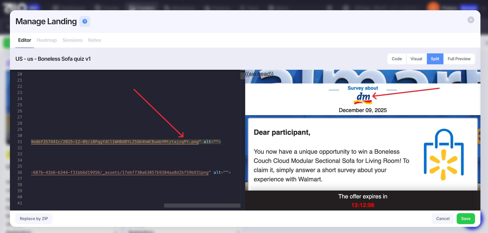

По такому же принципу продолжаем работу ( можно в режиме Visual, как удобнее)

Заменим фотографию на ледне (алгоритм действий повторяется)

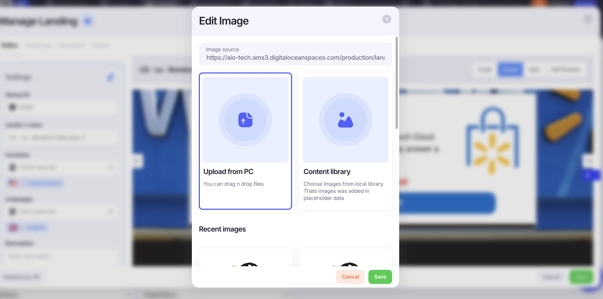

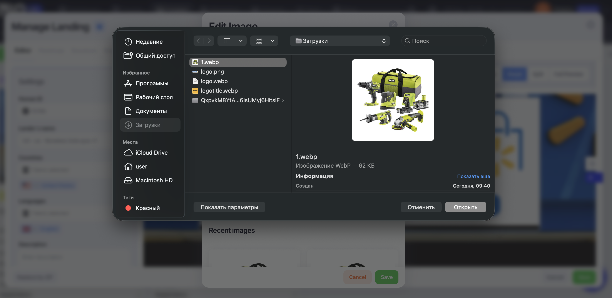

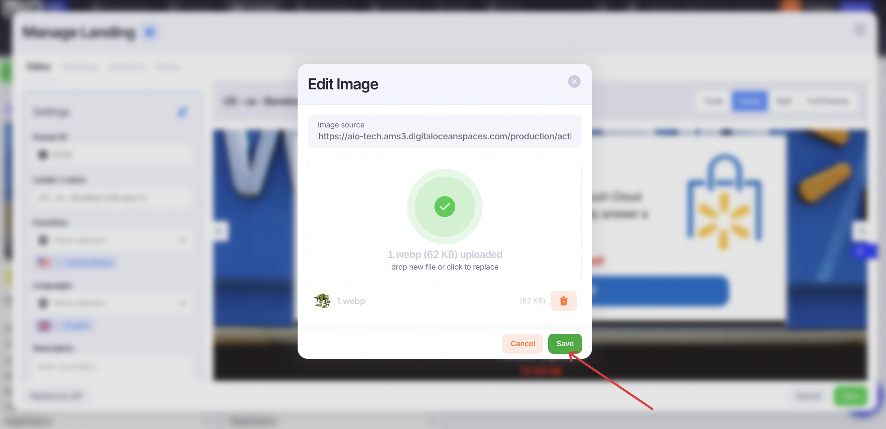

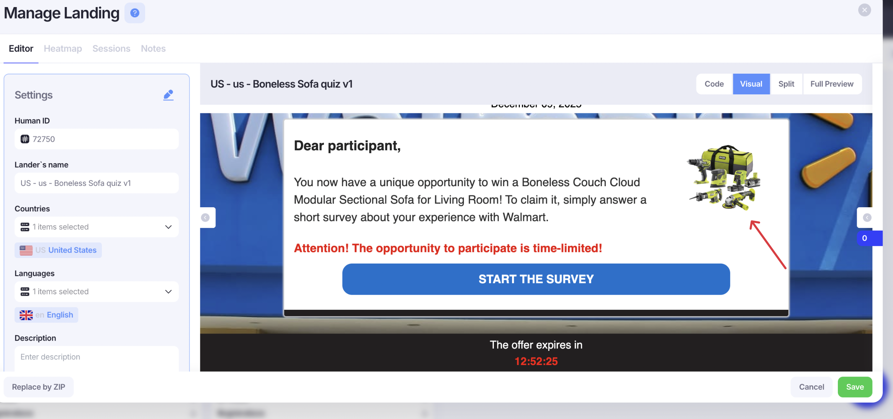

# Замена скрытых media-элементов, передающихся на оффер

1. Вводим в поисковик по коду сommand+F - “Hidden element”, для того чтоб быстрее добраться до фрагмента, который хранит в себе нужные нам фото

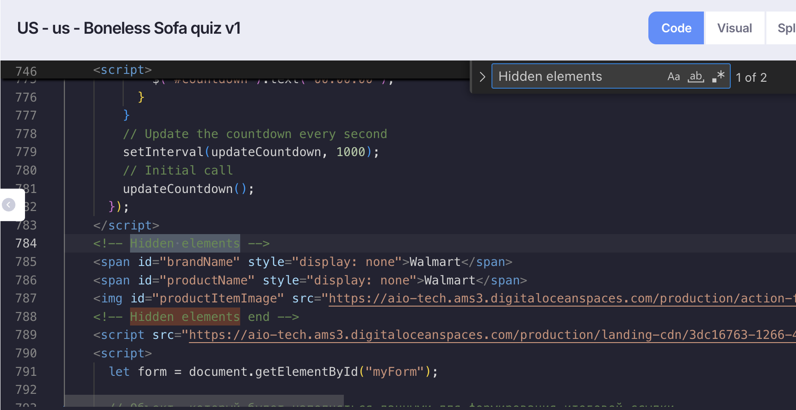

Общий вид фргамента:

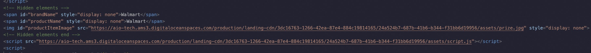

1. Обращаемся в конец пути нужного фото, в данном случае, productName и заменяем  в style = “display: none” на style = “display: block”

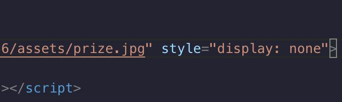

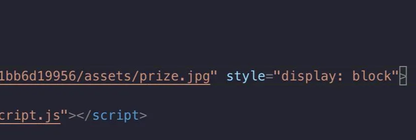

1. В режиме Split начнет отображаться фото, которое подтягивается на оффер - prize.jpg, по такому же принципу заменяем его на нужное

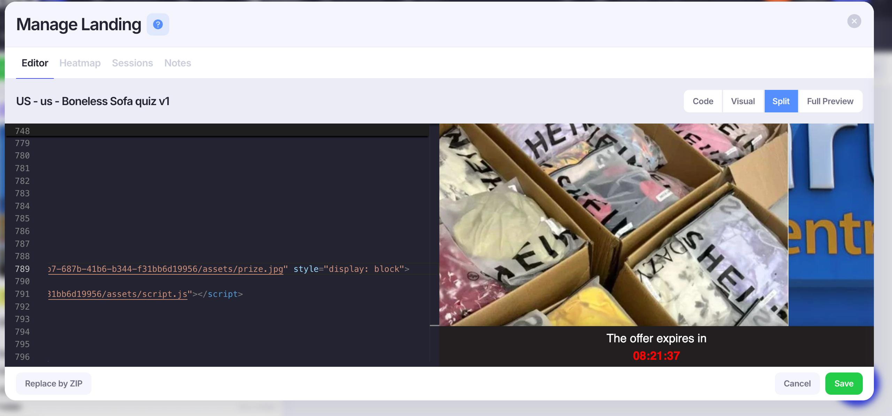

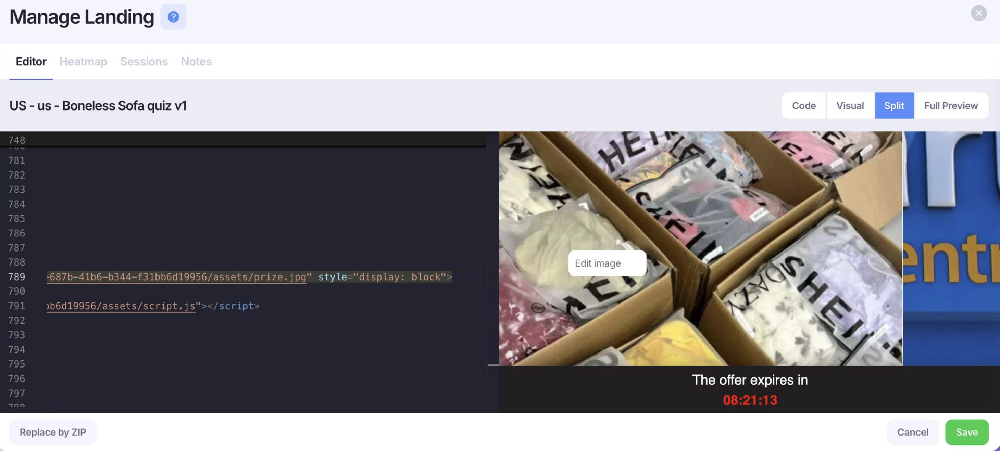

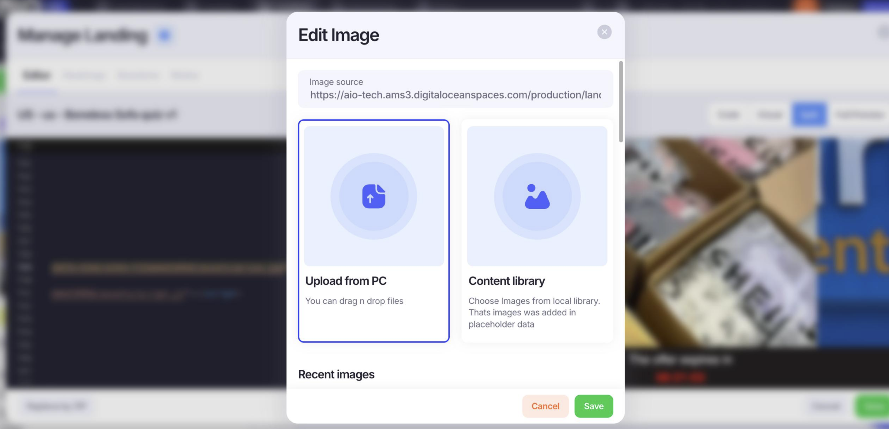

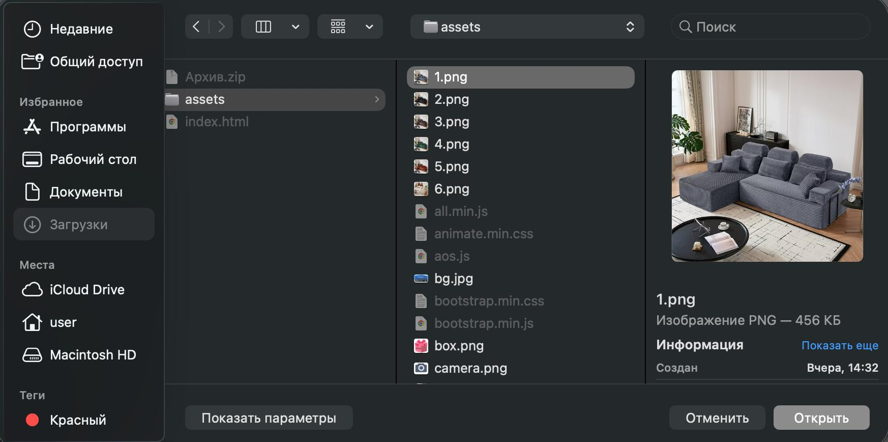

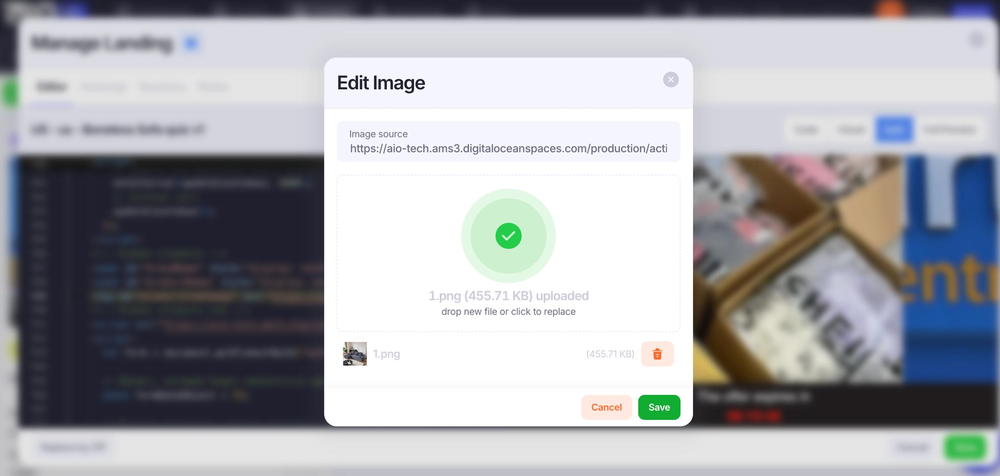

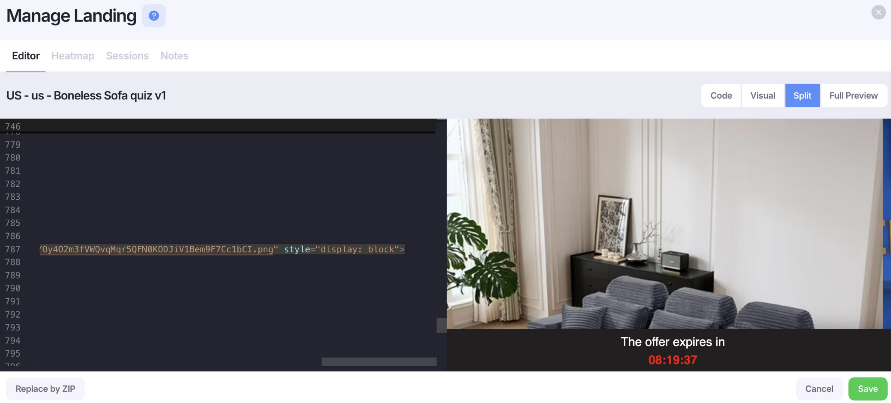

1. После смены картинки снова обращаемся в конец пути и заменяем style = “display: block” на style = “display: none” и сохранить изменения

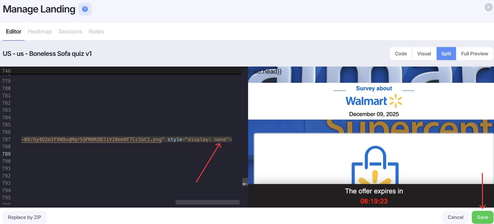