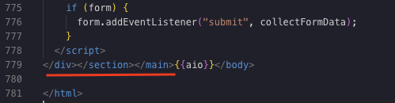

# Transfer land from Keitaro

### 1. В script.js в начало пути КАЖДОГО медиа добавить {{cdn}}

```jsx
src = "{{cdn}}/assets/media.png";
```

### 2. В index.html ( подходит для non-Prefill и Prefill)

Нужно заменить скрипт который отвечает за форму и генерацию ссылки, которая передаёт все данные на оффер на макрос

```jsx
{
  {
    aio: macros: passing_parameters;
  }
}
```

Сам скрипт, который вынесен в отдельный макрос:

```jsx
<script>
    let form = document.getElementById("myForm");

    const formDataObject = {};

    // Получаем параметр из URL
    function getUrlParameter(name) {
      name = name.replace(/[\[]/, "\\[").replace(/[\]]/, "\\]");
      const regex = new RegExp("[\\?&]" + name + "=([^&#]*)");
      const results = regex.exec(location.search);
      return results === null ? "" : decodeURIComponent(results[1].replace(/\+/g, " "));
    }

    const idpxl = getUrlParameter("idpxl");

    // Получаем значения скрытых элементов
    const brandNameVal = encodeURIComponent(document.getElementById("brandName").innerText);
    const productNameVal = encodeURIComponent(document.getElementById("productName").innerText);

    // ✅ Исправлено: логотип берём по src,
    const logoElement = document.getElementById("productLogo");
    const logoVal = logoElement ? logoElement.src : "";

    const productItemImage = document.getElementById("productItemImage");
    const imagePathVal = productItemImage ? productItemImage.src : "";

    console.log(logoVal);

    // Если формы нет (например, кнопка на ленде), прописываем ссылку в кнопку
    if (!form) {
      const modalButton = document.getElementById("p_modal_button3");

      if (modalButton) {
        modalButton.href = `{{link}}&idpxl=${idpxl}&brand_name=${brandNameVal}&product_name=${productNameVal}&product_image_url=${encodeURIComponent(
          imagePathVal,
        )}&logo=${logoVal}`;
        console.log("Updated href:", modalButton.href);
      } else {
        console.log("Button not found.");
      }
    }

    // Проверка обязательных полей формы
    function validateForm(form) {
      const requiredFields = ["firstName", "lastName", "address", "city", "zip", "phone", "email", "country"];
      let isValid = true;

      requiredFields.forEach((field) => {
        let input = form[field];
        let errorMessage = input.parentElement.nextElementSibling;

        if (errorMessage) {
          if (input.value.trim() === "") {
            errorMessage.style.display = "block";
            isValid = false;
          } else {
            errorMessage.style.display = "none";
          }
        }
      });

      return isValid;
    }

    // Сбор данных из формы
    function collectFormData(event) {
      event.preventDefault();

      if (!validateForm(form)) return;

      formDataObject.brandNameVal = brandNameVal;
      formDataObject.productNameVal = productNameVal;
      formDataObject.logoVal = logoVal;
      formDataObject.imagePathVal = imagePathVal;
      formDataObject.currentDomain = window.location.origin;

      formDataObject.firstNameVal = encodeURIComponent(form.firstName.value);
      formDataObject.lastNameVal = encodeURIComponent(form.lastName.value);
      formDataObject.addressVal = encodeURIComponent(form.address.value);
      formDataObject.cityVal = encodeURIComponent(form.city.value);
      formDataObject.zipVal = encodeURIComponent(form.zip.value);
      formDataObject.phoneVal = encodeURIComponent(form.phone.value);
      formDataObject.emailVal = encodeURIComponent(form.email.value);

      createFinalUrl(formDataObject);
    }

    // Формирование итоговой ссылки с редиректом
    function createFinalUrl(formDataObject) {
      const offerPath = `{{link}}`;

      let finalUrl =
        offerPath +
        `&first_name=${formDataObject.firstNameVal}&last_name=${formDataObject.lastNameVal}&address=${formDataObject.addressVal}&city=${formDataObject.cityVal}&zip_code=${formDataObject.zipVal}&phone=61${formDataObject.phoneVal}&email=${formDataObject.emailVal}&domain=${formDataObject.currentDomain}&product_image_url=${formDataObject.imagePathVal}&brand_name=${formDataObject.brandNameVal}&product_name=${formDataObject.productNameVal}`;

      window.location.replace(finalUrl);
    }

    if (form) {
      form.addEventListener("submit", collectFormData);
    }
  </script>
```

### 3. Залить ленд и проверить на наличие багов в разметке и стилях

При загрузке лендинга, AIO автоматически проверят вёрстку на валидность. В случае если он увидит незакрытый тег, он это сделает автоматически, что может сломать разметку.

#### Симптомы:

- Нет перехода на следующие этапы ленда
- Не отрабатывает корректно класс Cont
- Ломаются стили или применяются на другие блоки

#### Чаще всего:



- </div> удаляем
- </section>  переносим перед **<section class="cont loading" id="content2">**
- </main> переносим перед **<footer class="footer">**
