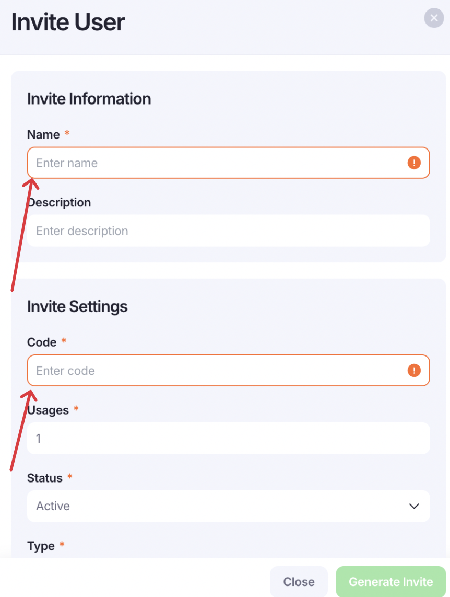
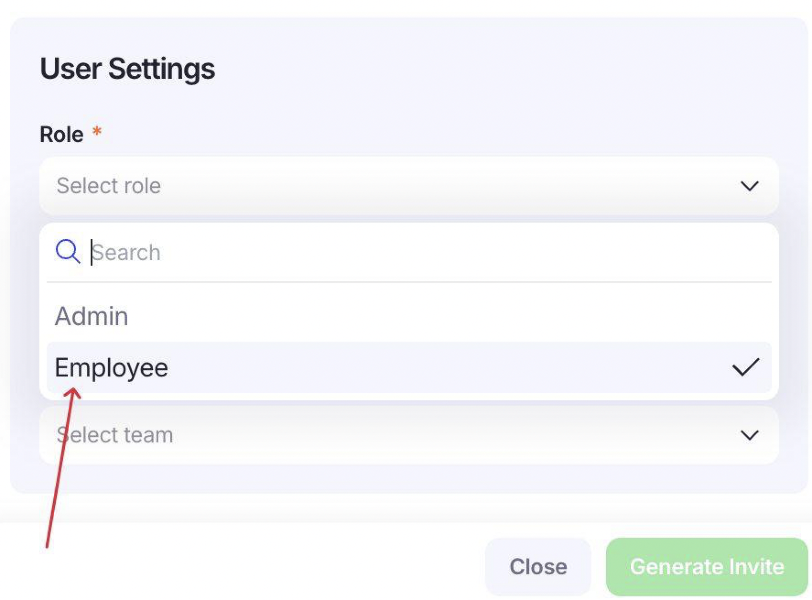
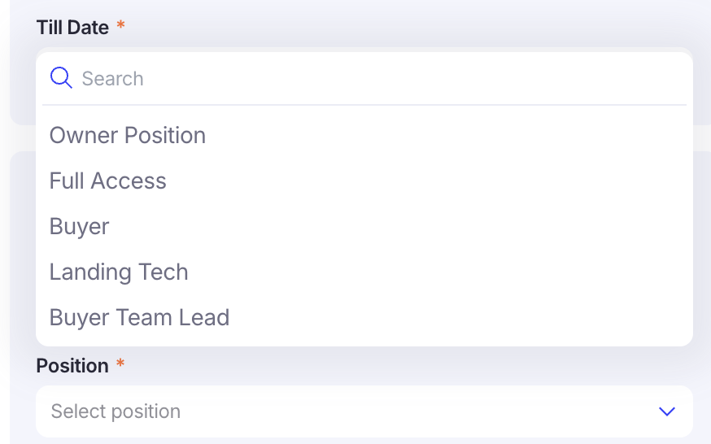
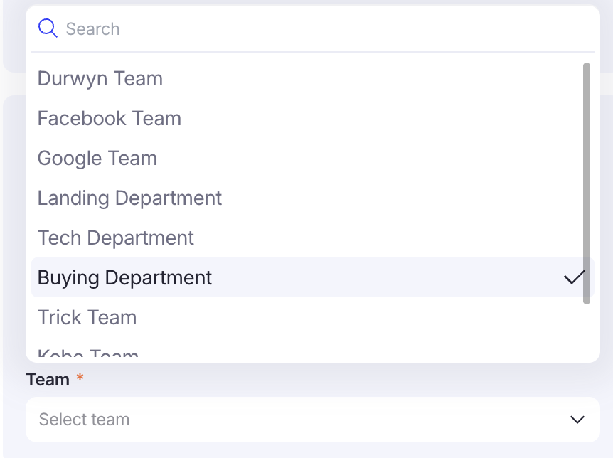

# New user

Добавление нового пользователя

Нажимаем на шестеренку и кликаем на  + User

Далее заполняем обязательные инпуты (код прописывается любой, условный , допустим, 676767). Status - active.

Role выбирается  Employee

[https://app.notion.com](https://app.notion.com)

Postion и Team в зависимости от должности сотрудника и принаджлежности к команде/отделу

Далее генерируется link и отправляется сотруднику для дальнейших настроек и заполнений данных