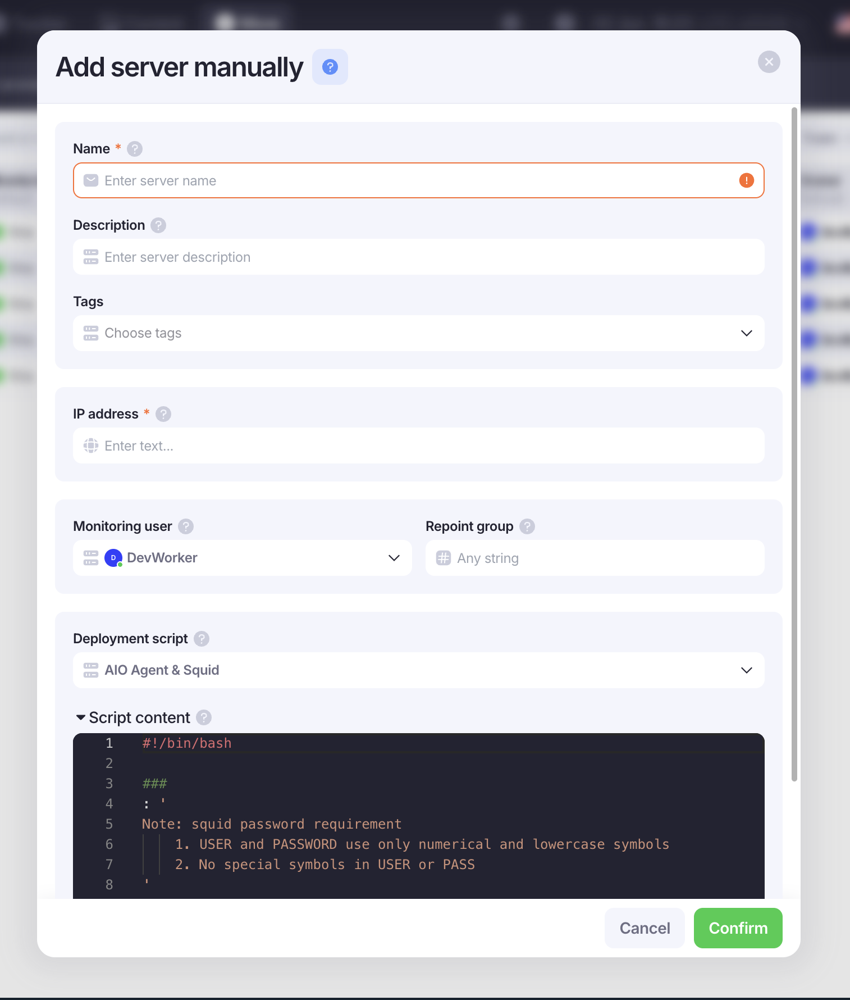

# Servers Purchase and Configuration

### Покупка сервера

Покупаем сервер на доступном ресурсе: Hostinger, Vultr, DigitalOcean.

1. Подключаемся к серверу по SSH
2. В AIO нажимаем **+ Server → Add manually**
3. Заполняем форму



| Поле                  | Значение                                       |
| --------------------- | ---------------------------------------------- |
| **Name**              | Название сервера                               |
| **Description**       | Провайдер + машина (например `Hostinger KVM1`) |
| **Tags**              | Проставляем теги                               |
| **IP address**        | IP-адрес нашего сервера                        |
| **Monitoring user**   | Указываем себя                                 |
| **Repoint group**     | Оставляем пустым                               |
| **Deployment script** | `AIO Agent & Squid`                            |

### Скрипт для сетапа сервера

Запускаем этот скрипт на самом сервере для его сетапа, запускать скрипт нужно по ssh

```bash
    ssh root@ip_сервера -p 22
```

!!! warning "Требования к паролю Squid"
    В полях `SQUID_USER` и `SQUID_PASS` используй **только цифры и строчные буквы** — без спецсимволов.

```bash
#!/bin/bash

SQUID_USER_ENV=
SQUID_PASS_ENV=

###

OS_ID=$(grep '^ID=' /etc/os-release | cut -d= -f2 | tr -d '"')

if [[ "$OS_ID" == "ubuntu" ]]; then
    ufw allow 80
    ufw allow 443
    ufw allow 9100
    ufw allow 9200
    ufw allow 9300
    ufw allow 5145
else
    echo "Non ubuntu installation, skip UFW"
fi

apt install cron git -y

## install docker if missed ##

if command -v docker &> /dev/null; then
    echo "Docker installation found"
else
    if [[ "$OS_ID" == "ubuntu" ]]; then
        apt-get update
        apt-get install -y ca-certificates curl
        install -m 0755 -d /etc/apt/keyrings
        curl -fsSL https://download.docker.com/linux/ubuntu/gpg -o /etc/apt/keyrings/docker.asc
        chmod a+r /etc/apt/keyrings/docker.asc
        echo "deb [arch=$(dpkg --print-architecture) signed-by=/etc/apt/keyrings/docker.asc] https://download.docker.com/linux/ubuntu $(. /etc/os-release && echo "${UBUNTU_CODENAME:-$VERSION_CODENAME}") stable" | tee /etc/apt/sources.list.d/docker.list > /dev/null
        apt-get update
        apt-get -y install docker-ce docker-ce-cli containerd.io docker-buildx-plugin docker-compose-plugin
    elif [[ "$OS_ID" == "debian" ]]; then
        apt-get update
        apt-get install -y ca-certificates curl
        install -m 0755 -d /etc/apt/keyrings
        curl -fsSL https://download.docker.com/linux/debian/gpg -o /etc/apt/keyrings/docker.asc
        chmod a+r /etc/apt/keyrings/docker.asc
        echo "deb [arch=$(dpkg --print-architecture) signed-by=/etc/apt/keyrings/docker.asc] https://download.docker.com/linux/debian $(. /etc/os-release && echo "$VERSION_CODENAME") stable" | tee /etc/apt/sources.list.d/docker.list > /dev/null
        apt-get update
        apt-get -y install docker-ce docker-ce-cli containerd.io docker-buildx-plugin docker-compose-plugin
    else
        echo "Unknown OS: $OS_ID"
        exit 1
    fi
fi

## install fresh compose ##
curl -L https://github.com/docker/compose/releases/download/v2.26.1/docker-compose-linux-x86_64 -o /usr/local/bin/docker-compose
chmod +x /usr/local/bin/docker-compose
ln -sfn /usr/local/bin/docker-compose /usr/bin/docker-compose

ssh-keyscan github.com >> ~/.ssh/known_hosts
ssh-keyscan gitlab.com >> ~/.ssh/known_hosts

cd /opt

git clone https://github.com/aiotech-public/aio-agent.git

cd /opt/aio-agent

echo API_URL=https://app.aio.tech/api/v1 >> .aio-env
echo SESSION_API_URL=https://sessions.aio.tech/api/v1 >> .aio-env

echo SQUID_USER=$SQUID_USER_ENV >> .aio-env
echo SQUID_PASS=$SQUID_PASS_ENV >> .aio-env
echo SESSION_ENCRYPTION_KEY=9fee140f098f6d685aa82452b9129457 >> .aio-env

(crontab -l ; echo "*\1 * * * * cd /opt/aio-agent && ./autopull.sh") | crontab - >> /dev/null

cp aio.service /etc/systemd/system/aio.service

systemctl start aio
systemctl enable aio
```

!!! success "Готово"
    Как скрипт закончит работу — нажимаем **Confirm**, сервер готов к добавлению доменов.
