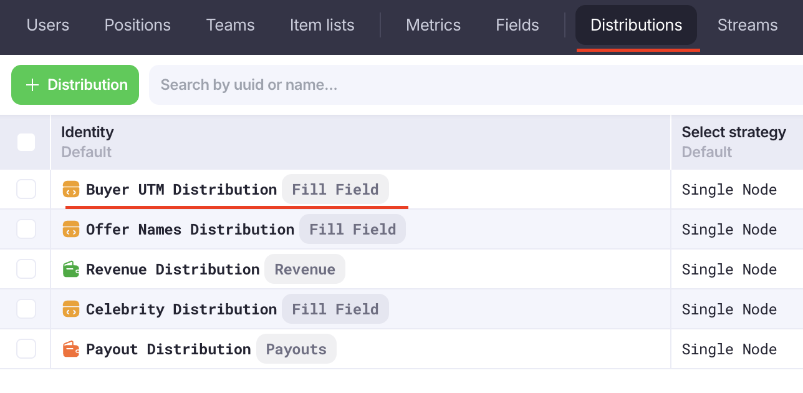
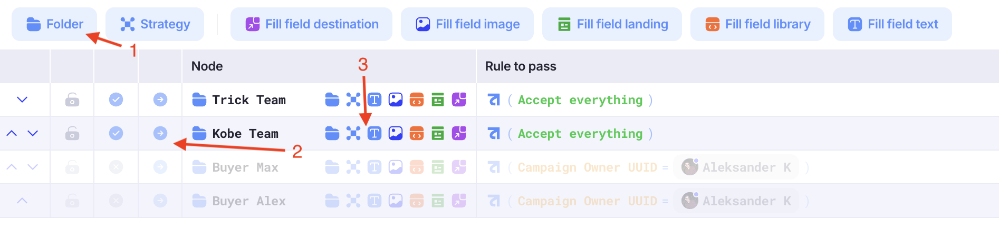
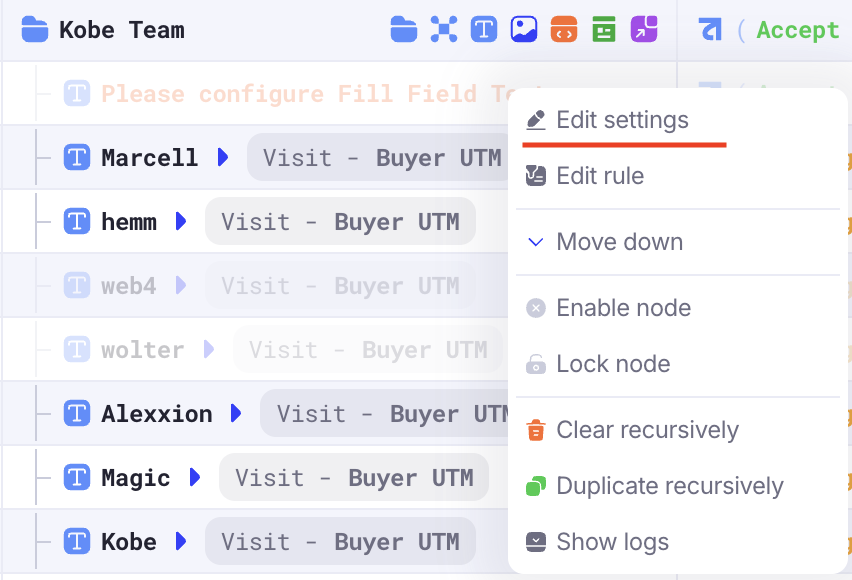
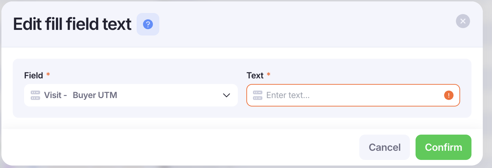
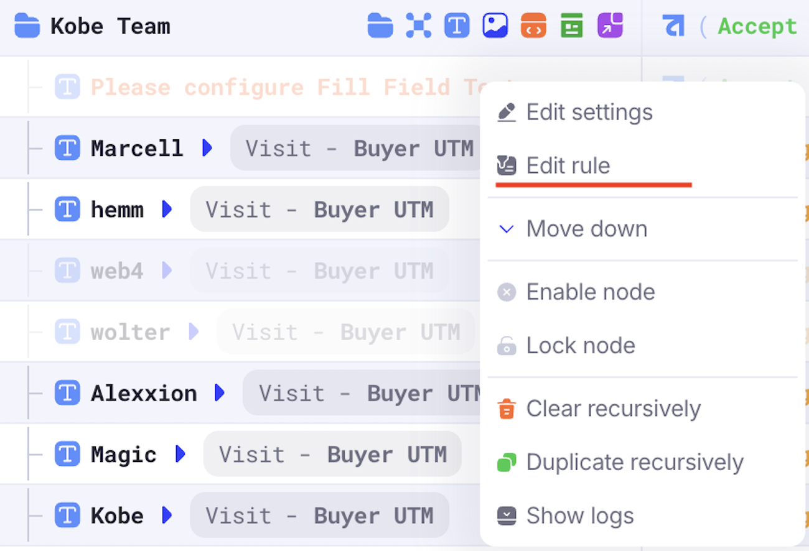
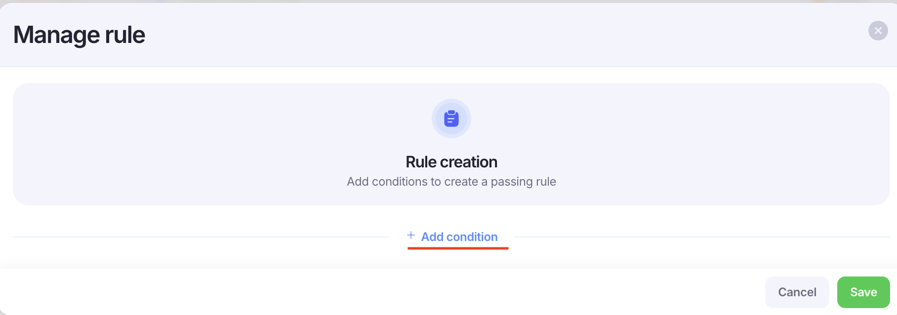
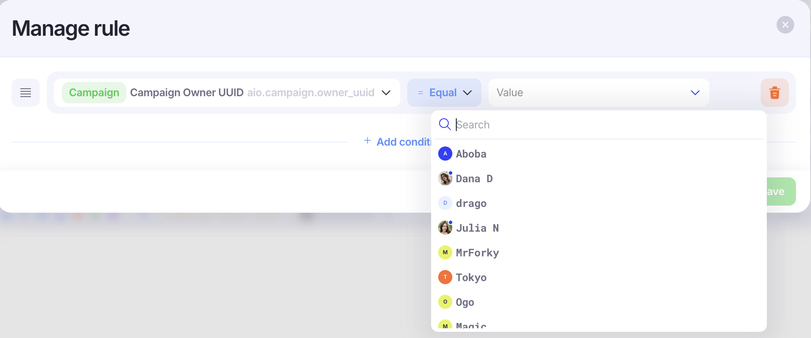

# Adding Buyer UTM for campaigns

Заходим во вкладку **Distributions** и нажимаем правой кнопкой мыши на **Buyer UTM Distribution**

Если баер из новой команды, нажимаем сначала добавить папку и меняем название на соответствующее

Если баер из уже существующей команды, нажимаем на стрелочку **Show children** и видим весь список баеров этой команды.

Затем нажимаем на кнопку добавить текст

Кликаем по новому полю правой кнопкой и выбираем из выпавшего меню **Edit settings**

В правом списке выбираем **Visit - Buyer UTM**, а в левом поле пишем текстом имя баера. Подтверждаем через кнопку **Confirm**

Кликаем по новому полю правой кнопкой и выбираем из выпавшего меню **Edit rule**

В новом окне нажимаем **+ Add condition**. Затем в левом списке выбираем **Campaign Owner UUID**, а в правом баера. Подтверждаем через кнопку **Save**

