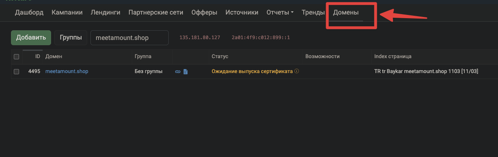

# Отключение ключа кампании

Если баеру нужны сетапы "без ключа кампании" — после стандартного сетапа делаем следующее.

## Процесс

1. Берём домен, который использовался при создании кампании
2. Переходим в кейтаро во вкладку **"Домены"**

3. Вставляем домен кампании в поиск
4. Нажимаем на найденный домен — откроется модальное окно
5. В модалке выполняем 2 пункта:
   - **Index-страница** — вставляем домен кампании, находим нужную кампанию
   - **Перехватывать 404** — выбираем "Перенаправить на кампанию"

6. Баеру отдаём только домены — без ключа кампании (всё что после домена/)
