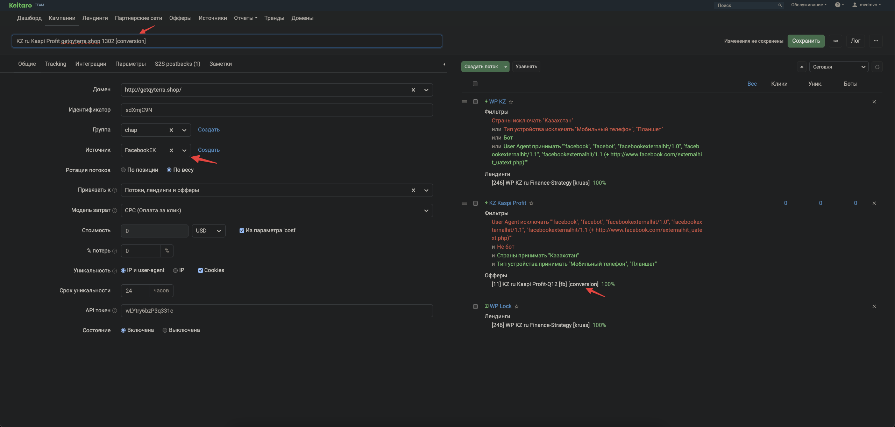

# Создание сетапа под facebookEK (conversionApi)

Делается так же, как [стандартный сетап](standard-setup-crypto.md), но с несколькими отличиями.

## Отличия от стандартного

1. В инпуте названия добавляем приписку `[conversion]`
2. В поле **"Группа"** выбираем `facebookEK`
3. В потоке оффера указываем оффер с припиской `[conversion]` — правильный id баер указывает в задаче

