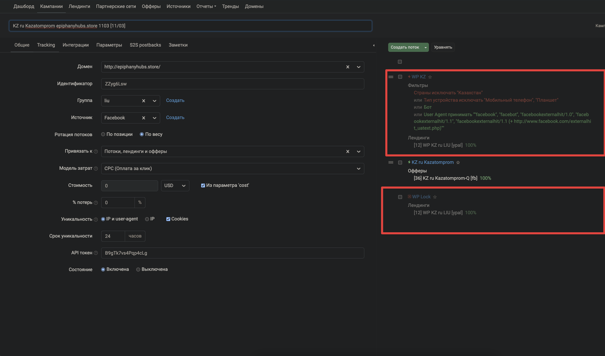

# Сетап в кейтаро без кло

Единственное отличие от [стандартного сетапа](standard-setup-crypto.md) — делается без фильтров.

## Процесс

1. Проделываем стандартные манипуляции с левой частью
2. В правой части не должно быть ничего, кроме самого оффера — без фильтров

3. Потоки оставляем на случай, если понадобится добавить фильтрацию
4. В потоке оффера фильтров тоже не должно быть

!!! tip "Важно"
Потоки оставляем всегда — на случай если баер попросит добавить фильтрацию позже.
