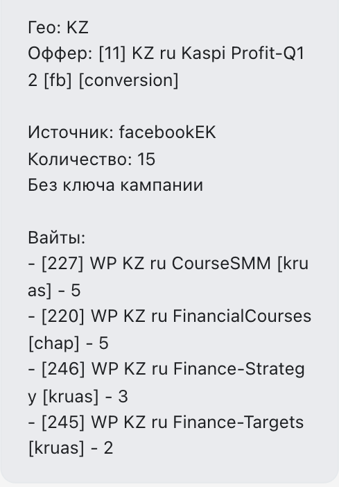
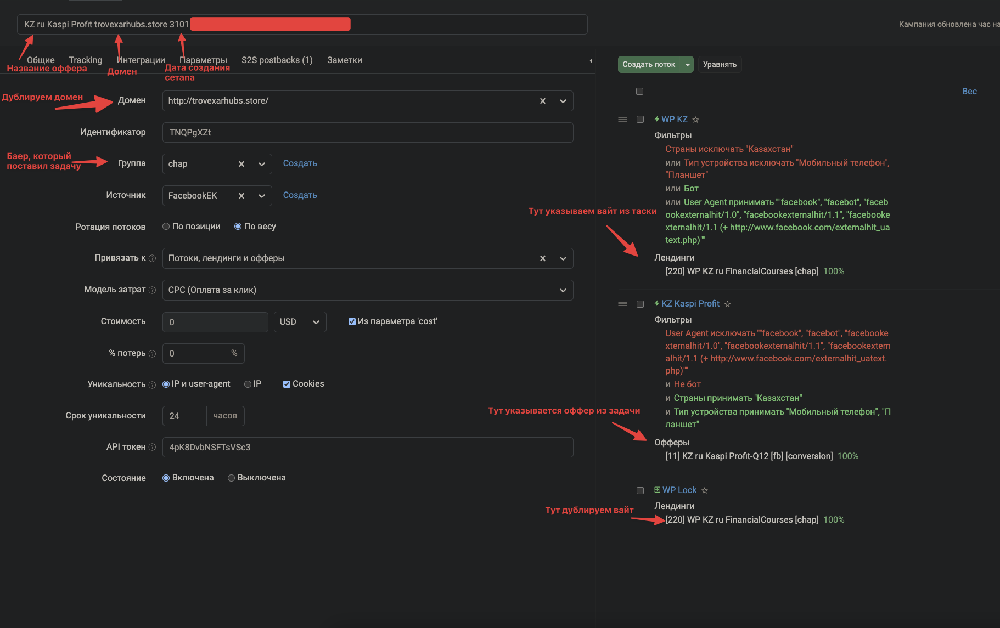

# Создание стандартного сетапа в кейтаро (Crypto)

Расшифровка стандартной таски на сетапы по направлению Crypto.

**Гео** — под какую страну делается сетап (Казахстан, Киргизия, Узбекистан, Турция и т.д.)

**Оффер** — id и название в кейтаро оффера, которые нужно будет указывать в потоке

**Источник** — источник, который указываем в сетапе (Facebook, FacebookEK, Google и т.д.)

**Кол-во** — кол-во кампаний, которые нужно будет сделать

**Без ключа кампании** — что нужно будет отдавать сетапы без ключа и дополнительно доменам прокинуть редирект

**Вайты** — id, названия и кол-во сетапов с указанным вайтом

## Процесс создания сетапа

1. Нужно занять домены в таблице **Setups [Crypto] (micrometrr)**
   - Возле свободного домена указать баера, название оффера и id
   - Продублировать информацию для нужного кол-ва доменов
2. Переходим в кейтаро и заходим во вкладку **"Кампании"**
3. Вверху таблицы сетапов есть выпадающее меню **"Все группы"** — находим баера, который поставил таску, применяем фильтр
4. Берём любой свежий сетап и копируем его
   - Ставим чекбокс возле нужного сетапа
   - В появившемся меню нажимаем **"Скопировать"**
   - Заходим в скопированный сетап
5. Изменяем сетап под свои нужды

## Заполнение полей

**Заголовок** — пример: `KZ ru Kaspi Profit trovexarhubs.store 3101`

- `KZ ru Kaspi Profit` — страна, язык, название оффера и направление
- `trovexarhubs.store` — домен из таблицы
- `3101` — сегодняшняя дата

**Домен** — дублируем домен, который используем

**Группа** — указываем баера, который поставил таску

**Поток "WP"** (нецелевой трафик) — устанавливаем вайт из таски + фильтры (фильтры одинаковые для всех сетапов, меняется только страна)

**Второй поток** (целевой трафик) — выставляем оффер из таски + фильтры. Название потока должно совпадать с инпутом слева

**Поток "WP Lock"** — дублируем вайт из потока WP
